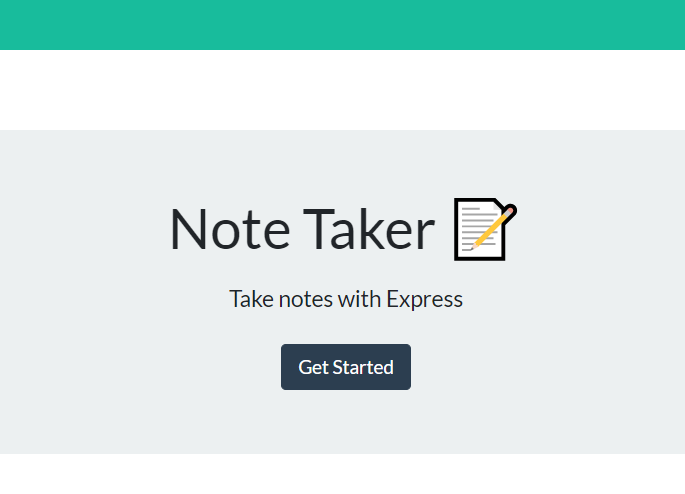
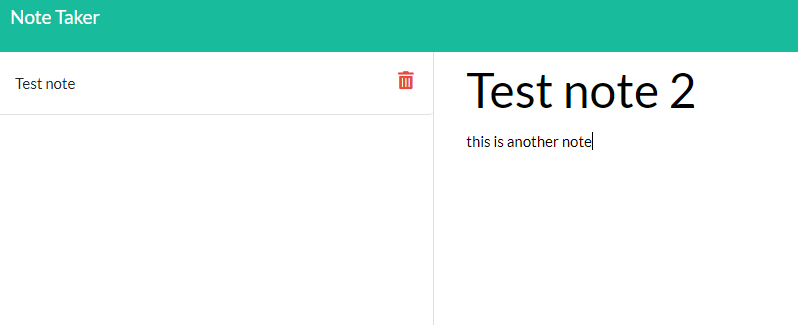
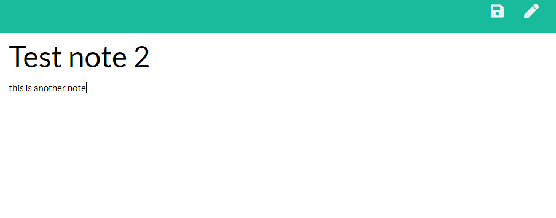

# Note-Taker

This application allows users to create and save new notes. When they no longer need the note, they are able to delete it.

## How it works

The note taker uses Express.js to save and delete user posts. Every new note is assigned a unique ID and then is saved into an array. Not only will all of the current notes be displayed on the left, the user can also view the entire array of note objects by routing to /api/notes. When the user clicks delete, only that post will be deleted and the array of note objects will be updated and displayed again in the db.json file.

## Concepts showcased

This was my first application to link the front and back end. Express.js was used for routing and displaying pages to the user. The static middleware from Express was key in linking the front and backends. Fs node.js module was used to write and read the files that hold the array of note objects.

## How it looks

